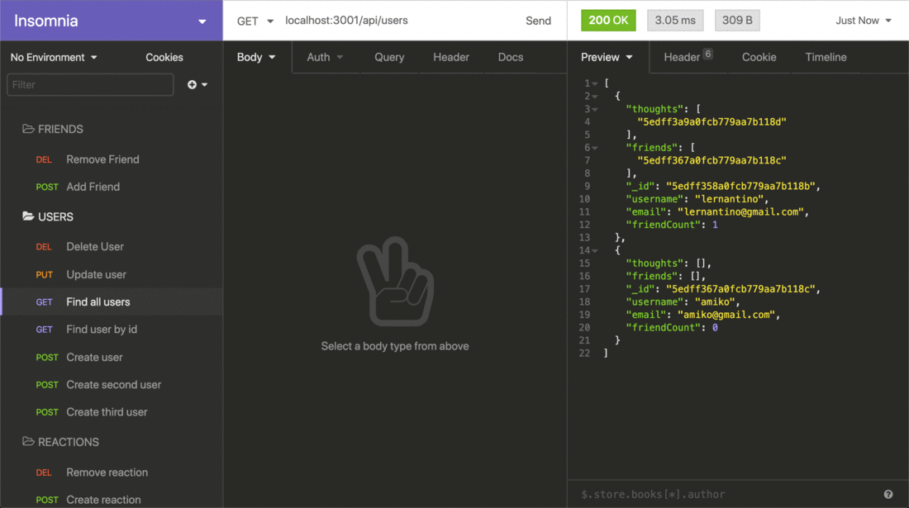

# 18 NoSQL: Social Network API

## Your Task

Your homework is to build an API for a social network web application where users can share their thoughts, react to friends’ thoughts, and create a friend list. You’ll use Express.js for routing, a MongoDB database, and the Mongoose ODM. In addition to using the [Express.js](https://www.npmjs.com/package/express) and [Mongoose](https://www.npmjs.com/package/mongoose) packages, you may also optionally use a JavaScript date library of your choice or the native JavaScript `Date` object to format timestamps.

No seed data is provided, so you’ll need to create your own data using Insomnia after you’ve created your API.

## Mock Up

## Getting Started

Be sure to have MongoDB installed on your machine. Follow the [MongoDB installation guide on The Full-Stack Blog](https://coding-boot-camp.github.io/full-stack/mongodb/how-to-install-mongodb) to install MongoDB locally.

### Installation
`npm init`

`npm install`

## Usage
`npm start`

## Testing
No current testing

## Questions
✉️ Contact me with any questions: [GitHub](https://github.com/CodeDavid09) 